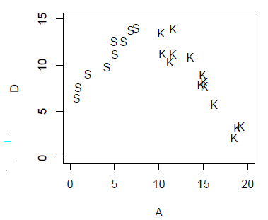
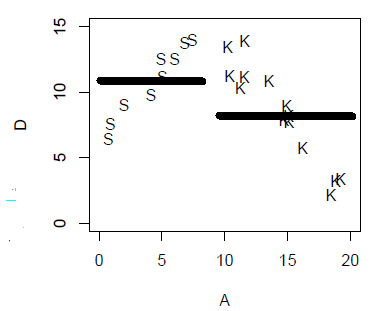
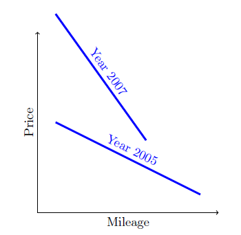
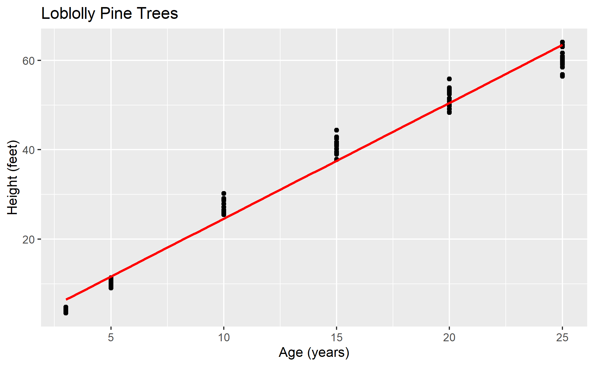

```{r setup, include=FALSE}
knitr::opts_chunk$set(echo = TRUE)
library(tidyverse)
library(mosaic)
library(viridis)
```

**Instructions.** Change the author name on line 3 to be your name.
Insert all requested answers. Upload in Moodle a zip file containing
this file, a knitted file (html, doc, or pdf), and the various image
files that came with this assignment. You may also include the
modification of the *Chapter06_Hand_Plots.pdf* file containing your
answers, or you may turn that in on paper.

### Exercise 1 (72 points).

Answer from *Statistical Modeling: End-of-Chapter Exercises* by Daniel
Kaplan the following. I provide enough of each problem (Prob) or reading
exercise (Read) so that it should be relatively easy to type your
answers (text or code) in this file. I also provide some clarifications
and hints. Note that Kaplan does not always include the correct value in
his multiple choice questions!\*

\*Doesn't that kind of defeat the point of a multiple choice question?
If the right answer might not be in there, why give a list of potential
answers at all?

**Prob 6.01 (2 points).** In McClesky vs Georgia, lawyers presented data
showing that for convicted murderers, a death sentence was more likely
if the victim was white than if the victim was black. For each case,
they tabulated the race of the victim and the sentence (death or life in
prison). Which of the following best describe the variables their
models?

Both variables are categorical.

**Prob 6.02 (8 points--1 point for each answer).** In studies of
employment discrimination, several attributes of employees are often
relevant: age, sex, race, years of experience, salary, whether promoted,
whether laid off. For each of the following questions, indicate which is
the response variable and which is the explanatory variable.

1.  Are men paid more than women?

Response Variable: salary

Explanatory Variable: sex

2.  On average, how much extra salary is a year of experience worth?

Response Variable: salary

Explanatory Variable: years of experience

3.  Are whites more likely than blacks to be promoted? (Note: I would
    strongly encourage that you revise that question to "Are White
    people more likely than Black people to be promoted?")

Response Variable: whether promoted

Explanatory Variable: race

4.  Are older employees more likely to be laid off than younger ones?

Response Variable: whether laid off

Explanatory Variable: age

**Prob 6.03 (18 points--3 points for each answer).** The scatter plot
shows some data involving three variables



-   D is a quantitative variable

-   A is a quantitative variable

-   G is a categorical variable with two levels: S & K

Here is a sketch of the function for the model D \~ G:



Sketch similar functions for each of the following models:

(a) D \~ A+G

(b) D \~ A-1

(c) D \~ A

(d) D \~ A\*G

(e) D \~ 1

(f) D \~ poly(A,2)

The *Chapter06_Hand_Plots.pdf* file contains six copies of the scatter
plot. You may print this file onto paper, sketch your answers, and turn
in the piece of paper. Alternatively, you may draw on the document
electronically and upload the electronic file with your other work.

**Prob 6.04 (12 points--3 points for each answer).** Using your general
knowledge about the world, think about the relationship between these
variables:

-   speed of a bicyclist.

-   steepness of the road, a quantitative variable measured by the grade
    (rise over run). 0 means flat, + means uphill, - means downhill.

-   fitness of the rider, a categorical variable with three levels:
    unfit, average, athletic.

On a piece of paper (you could use the *Chapter06_Hand_Plots.pdf* file),
sketch out a graph of speed versus steepness for reasonable models of
each of these forms:

1.  Model 1: speed \~ 1 + steepness

2.  Model 2: speed \~ 1 + fitness

3.  Model 3: speed \~ 1 + steepness + fitness

4.  Model 4: speed \~ 1 + steepness + fitness + steepness:fitness

**Prob 7.03 (10 points--1 point for each answer).** For some simple
models, the cofficients can be interpreted as grand means, group-wise
means, or differences between group-wise means. In each of the
following, `A`, `B`, and `C` are quantitative variables and `color` is a
categorical variable with levels `red`, `blue`, and `green`.

(a) The model `A ~ color` gave these coefficients:

| term       | coefficient |
|------------|-------------|
| Intercept  | 10          |
| colorBlue  | 5           |
| colorGreen | 12          |

-   What is the mean of A for those cases that are Blue? 15

-   What is the mean of A for those cases that are Green? 22

-   What is the mean of A for those cases that are Red? Red is reference
    group so the mean is 10.

-   What is the grand mean of A for all cases? The model doesn't say

-   The model `B ~ color - 1` gave these coefficients:

| term       | coefficient |
|------------|-------------|
| colorRed   | 100         |
| colorBlue  | -40         |
| colorGreen | 35          |

-   What is the group mean of B for those cases that are Blue? -40

-   What is the group mean of B for those cases that are Red? 100

-   What is the group mean of B for those cases that are Green? 35

-   What is the grand mean of B for all cases? The model doesn't say

(c) The model `C ~ 1` gave this coefficient:

| term      | coefficient |
|-----------|-------------|
| Intercept | 4.7         |

-   What is the group mean of C for those cases that are Blue? The model
    doesn't say

-   What is the grand mean of C for all cases? 4.7

**Prob 7.04 (12 points--3 points for each answer).** Rather than stating
the modeling statement, include a code chunk that executes the
appropriate `lm` command.

(a) From the `CPS85` data, what is the mean age of single people?

    ```{r}
    lm(age ~ married - 1, CPS85)
    ```

(b) From the `CPS85` data, what is the difference between the mean ages
    of married and single people?

    ```{r}
    lm(age ~ married, CPS85)
    ```

(c) From the `SwimRecords` data, what is the mean swimming time for
    women?

    ```{r}
    lm(time ~ sex - 1, SwimRecords)
    ```

(d) From the `Utilities` data, what is the mean CCF for November?

    ```{r}
    lm(ccf ~ as.factor(month) - 1, Utilities)
    ```

    The mean CCF for November is 99.60.

**Prob 7.07 (6 points--2 points for each answer).** In the `SAT` data,
the variables have these units:

-   `sat` has units of "points."

-   `expend` has units of "dollars."

-   `ratio` has units of "students."

-   `frac` has units of "percentage points."

Consider the model formula `sat = 994 + 12.29 expend - 2.85 frac`.

(a) What are the units of the coefficient 994? points

(b) What are the units of the coefficient 12.29? points per dollar

(c) What are the units of the coefficient 2.85? points per percentage
    point

**Prob 7.08 (6 points--2 points for each answer).** The graph shows
schematically a possible relationship between used car price, mileage,
and the car model year.



Consider the model `price ~ mileage*year`.

AKA `price ~ 1 + mileage + year + mileage:year`

In your answers, treat `year` as a simple categorical variable, and use
year 2005 as the reference group when thinking about coefficients.

(a) What will be the sign of the coefficient on mileage? Negative
    (Greater mileage would decrease the price.)

(b) What will be the sign of the coefficient on model year? Positive (A
    2007 car would be more expensive than a 2005 car.)

(c) What will be the sign of the interaction coefficient? Positive (I
    assume that for a 2007 car, more mileage would be more of an issue
    than in a 2005 car because the latter has been around longer and is
    assumed to have been driven more. On that basis, I would say that
    interaction coefficient would be positive because the negative
    relationship between mileage and price would be stronger for 2007
    cars. In feedback please let me know if this assumption is
    incorrect.)

### Exercise 2 (20 points).

Consider the scatter plot below with the overlaid best fit straight line
model. Interpret the lowest point (6 points), estimate an equation for
the straight line (6 points), provide an interpretation of the
coefficients in your equation (6 points), and estimate the standard
deviation of the residuals (2 points).



By "lowest point" I assume you mean lowest point on the model. Since the
line begins at one year, I assume that the height of a tree is first
measured at one year, and at that time the mean height is about 7 feet.
That lowest point is not the intercept; we would have to extrapolate
that instead of using the real-world fact that when a tree is planted it
is always zero feet tall.

The intercept looks to be about 6 feet, and the slope about 1.2: (12-6
feet)/(5-0 years), so the equation would be height = 6 + 1.2(age).

The 6 represents the extra 6 feet of growth that occurs during the first
year and the 1.2 indicates that a loblolly pine will grow about 1.2 feet
per year.

The standard deviation of the residuals looks like it might be two or
three years.

### Exercise 3 (51 points).

With the `KidsFeet` data, do the following.

a.  (10 points) Obtain a scatter plot of foot width vs. foot length with
    the points different colors for boys and girls. Overlay on the plot
    straight line models for each sex. This will be similar to the plot
    provided by Kaplan in Prob 7.05 but with straight lines rather than
    points for the two models.

    ```{r}
    KidsFeet %>% ggplot(aes(x = length, y = width, color = sex)) +
      geom_point() +
      geom_smooth(method = 'lm', se = FALSE)
    ```

b.  (15 points) Obtain the best fit formula for the model
    `width ~ length` (5 points). Provide a meaningful interpretation of
    the formula (6 points), residual standard error (2 points), and
    R-squared (2 points).

    ```{r}
    kfmodel = lm(width ~ length, KidsFeet)
    summary(kfmodel)
    ```

    The model predicts that the width of a child's larger foot is a
    quarter (0.248) of its length plus 2.86 cm. The RSE is 0.40 cm and
    R-squared is 0.40.

    Because this model doesn't tell us anything about the sex
    differences in foot width, it can't outright answer the question at
    hand--- should girls' shoes be narrower than boys' shoes of the same
    length? What I can say is that the RSE seems pretty small out of
    context, but a shoe that is half a centimeter narrower than it
    should be could cause issues. Many styles of girls' shoes do not
    have adjustable widths (as opposed to sneakers or boots with laces
    or velcro) and so cannot account for natural human variation.\*
    Evidently there is a lot of variation not explained by this model,
    because the length of the foot only accounts for 40% of that
    variation.

    \*The difference in styles between girls' and boys' shoes might help
    explain why girls' shoes tend to be narrower.

c.  (21 points) Obtain the best fit formula for the model
    `width ~ sex * length`(5 points). Provide a meaningful
    interpretation of the formula (12 points), residual standard error
    (2 points), and R-squared (2 points).

    ```{r}
    kfmodel2 = lm(width ~ sex * length, KidsFeet)
    summary(kfmodel2)
    ```

    The model predicts that the width of a girl's longer foot is 0.23
    times its length plus 3.23 cm, while the width of a boy's longer
    foot is 0.21 times its length plus 3.85 cm. The RSE is 0.39 and
    R-squared is 0.41.

    Because the length coefficients are similar but the intercepts
    differ by about 0.6 cm, I would say that according to this model
    there is probably some merit to using different proportions for
    girls' shoes and boys' shoes. I also know that there have been a
    number of cases where militaries have needed to buy narrower combat
    boots for their female soldiers because the male-standard boots were
    too wide and hurt their feet, so I wouldn't be surprised if
    children's shoes needed to reflect a similar disparity. (See
    *Invisible Women* by Caroline Criado Perez, Chapter 8:
    One-Size-Fits-Men.)

    However, the RSE is 0.39 cm, which is more than half of the
    difference of intercepts. Given the natural variation in childrens'
    feet, and that fact that this model only accounts for 41% of the
    variation in width, I can't say I'm convinced that girls' shoes need
    to be narrower. I certainly wouldn't base an industry standard on
    it.

    With all that said, I think companies should just make shoes with
    different widths relative to lengths, like a size 8N vs 8W (narrow
    vs. wide), etc, and they should do this for all shoes so kids can
    wear whatever shoes they want regardless of the width of their feet.

d.  (5 points) Discuss which of the two previous models is a better
    representation of the data.

    Based on the original graph, it seems like there could be merit to
    including sex as an explanatory variable. The second model has a
    lower RSE and higher R-squared. However, the differences are quite
    small. According to my dad, an f-test would tell me whether or not
    the small increase in R-squared constitutes a significant increase
    in explanatory power, so the results of that test would probably
    answer the overarching question about whether or not a girls' shoe
    should be narrower than a boy's shoe of the same style.
